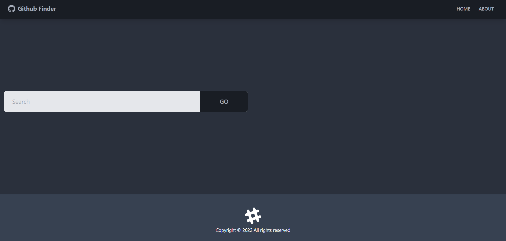

# Github Finder

This website enables to search Github users and display their info.

## 👉 [View Live ](https://m-techtrek.vercel.app/)

# How to Use

1. You can use the Github API without a personal token, but if you want to use your token, add it to the .env file
2. Install dependencies - npm install
3. Run - npm start

## Preview

